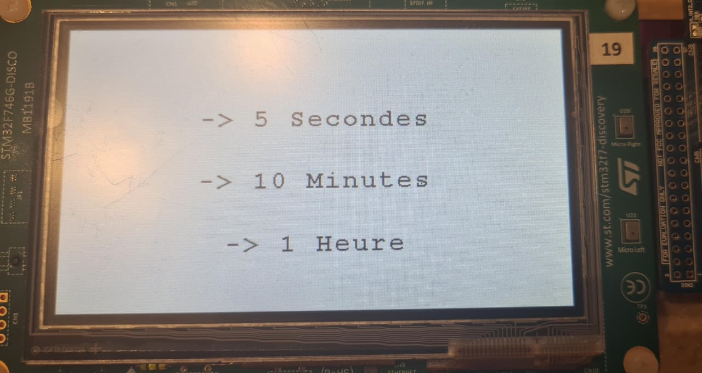
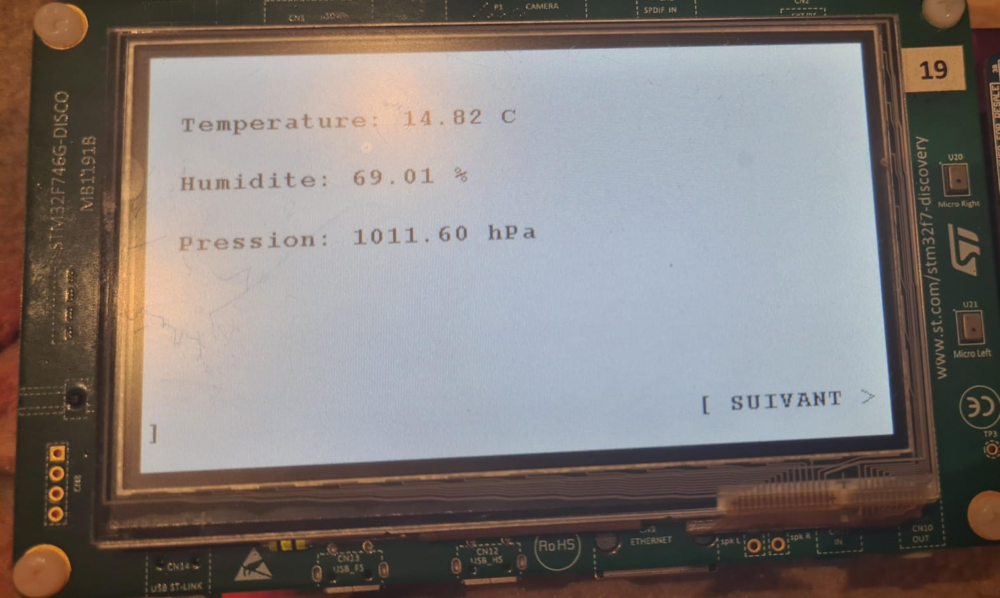
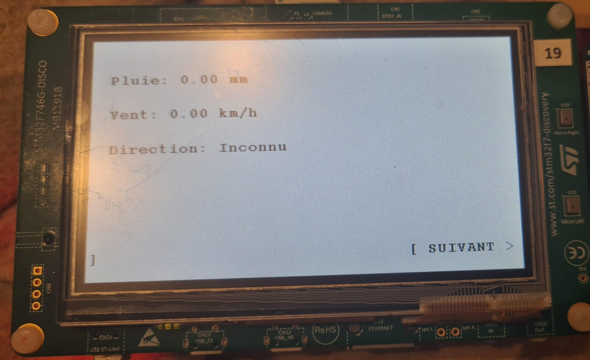

# 🌦️ Station Météorologique Connectée - STM32F7

Ce projet implémente une station météo autonome sur la carte de développement **STM32F746G-DISCO**. Il combine l'acquisition de données environnementales multi-capteurs avec une **interface graphique tactile (GUI)** moderne et un système d'enregistrement sur carte SD.

---

##  Fonctionnalités Principales

### 1. Interface Homme-Machine (IHM)
Une interface tactile fluide et "User Friendly" conçue en langage C (sans images lourdes) pour optimiser la mémoire :
* **Page 1 : Configuration** - Sélection tactile de la fréquence d'acquisition (5s, 10min, 1h).
* **Page 2 : Dashboard Atmosphérique** - Affichage de la Température, Humidité et Pression avec **barres de progression visuelles**.
* **Page 3 : Météo Extérieure** - Monitoring du Vent (Vitesse/Direction) et de la Pluviométrie.
* **Navigation** : Système de menu intuitif et mise en veille automatique de l'écran (Timer 4).

### 2. Acquisition de Données
Le système gère plusieurs protocoles de communication pour les capteurs :
* **I2C** : Température & Humidité (HTS221), Pression (LPS22HH).
* **ADC** : Girouette (Direction du vent).
* **Timers & Interruptions** : Anémomètre (Vitesse vent via Input Capture) et Pluviomètre (GPIO Interrupt).

### 3. Data Logging
* Enregistrement périodique des relevés sur **Carte MicroSD** au format `.CSV`.
* Système de fichiers FatFS intégré.

---

##  Architecture Technique

### Matériel
* **Carte Principale :** STM32F746NG Discovery (ARM Cortex-M7).
* **Extension :** Shield X-NUCLEO-IKS01A3 (Capteurs MEMS).
* **Capteurs Externes :** SparkFun Weather Meters (Pluie, Vent).

### Configuration des Timers (Hardware)
L'allocation des ressources est optimisée pour éviter les conflits d'interruptions:

| Timer | Fonction | Configuration |
| :--- | :--- | :--- |
| **TIM1** | Anémomètre | Mode Input Capture (Mesure précise des fronts montants). |
| **TIM2** | Data Logger | Interruption périodique (Écriture SD). |
| **TIM3** | Touchscreen | Polling tactile (20ms). |
| **TIM4** | Économie d'énergie | Watchdog logiciel pour extinction écran (60s). |
| **TIM5** | Acquisition | Boucle principale de lecture des capteurs. |

---

## Aperçu du Projet

| Configuration (Page 1) | Dashboard (Page 2) |
| :---: | :---: |
|  |  |

| Météo Extérieure (Page 3) | 
| :---: | :---: |
|  |

---

## Structure du Code

SE_Project/ ├── Core/Src/ │ ├── main.c # Boucle principale et orchestration │ ├── stm32f7xx_it.c # Gestionnaires d'interruptions │ └── ... ├── Drivers/Sensors/ # Drivers personnalisés │ ├── humidity.c │ ├── pression.c │ └── pluviometre.c ├── Drivers/UI/ # Gestion de l'affichage │ ├── ui.c # Dessin vectoriel des widgets │ └── ui.h # Structures de données └── ...

---

© 2024 - Projet Station Météo STM32
